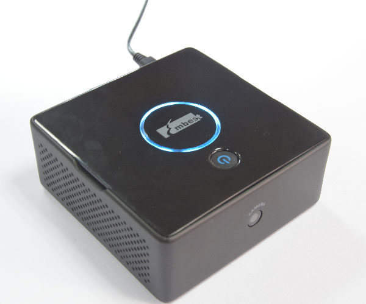
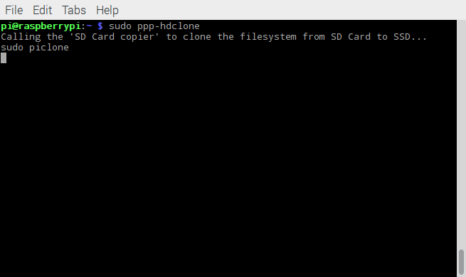
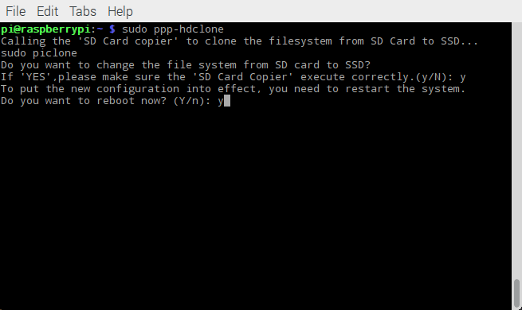

# Pi Desktop User Manual




## Introduction

The Pi Desktop is a desktop computer kit based on Raspberry Pi 2/3. It includes a case, an expansion board which can turn Raspberry Pi into a real desktop PC.
It provides an intelligent and safe power controller, a realtime clock and a high capacity Solid State Drive (SSD) expansion card to provide additional storage.

**Pi Desktop + SSD + Raspberry Pi 2/3 = A Desktop PC**

### Features

- An intelligent power controller to enable to turn on / off the Pi by pressing a button
- mSATA socket for up to 1TB on-board storage, Can boot from SSD directly
- Integrated RTC (Real Time Clock)
- Included a case and a heat sink

### Packing List

1. Add-On board
2. Heat sink
3. USB Adapter (Micro-Type A)
4. Long Spacer (x4)
5. Screws (x2)
6. Enclosure

> **TODO** 
>
> [Need Stephen to reconfirm] How many screws are there? 2 or 4? For mSATA or enclosure? 

> **TODO** 
>
> [Need Stephen to reconfirm] Is there a button cell included? 

## Assembly & Install

Here is a video overview and setup walkthrough: 
> **TODO**
> [Marketing or Engineering] Insert a assembly help video

### Additional Required Items

1. Raspberry Pi 3 or 2
2. Pre-programmed Micro SD Card
3. Power Supply (5V@2.5A)
4. mSATA SSD, max. up to 1TB or USB Flash Drive (Optional) 
5. HDMI Monitor
6. Camera Module (Optional)
7. HDMI Cable
8. USB Keyboard & Mouse

#### Power Supply Selection Guide

**! IMPORTANT !** To ensure stability you will need a good power supply, at least a 5V@2A power supply to power the Pi Desktop. Any power supply with current capacity under 2A may damage the filesystem and even the hardware. 

The Raspberry Pi Foundation suggests to use [a 5V@2.5A with Pi3](https://www.raspberrypi.org/help/faqs/#powerReqs), and [a 5V@1.8A with Pi2](https://www.raspberrypi.org/help/faqs/#powerReqs).

We recommend you to use a Raspberry Pi official power supply:
- [5V@2.5A with Pi3](http://uk.farnell.com/stontronics/t6090dv/psu-raspberry-pi-5v-2-5a-uk-euro/dp/2520786)
- [5V@2A with Pi2](https://www.raspberrypi.org/products/universal-power-supply/)

### Assembly Instruction

> **TODO**
> [Marketing] Insert the install illustration

1. Remove the protective film from the bottom of the heat sink and place it on the top of the Processor on the Raspberry Pi.
2. Insert the pre-programmed micro-SD card into Raspberry Pi SD card slot. 

    Don’t have one? Download the latest **Rasbian Jessie with PIXEL** image from the below link and write to the uSD card using preferred image writer (recommended tool - Win32DiskImager) following [the offical guide](https://www.raspberrypi.org/documentation/installation/installing-images/README.md). 
    [https://www.raspberrypi.org/downloads/](https://www.raspberrypi.org/downloads/) 
3. (Optional) - Connect the Pi Camera into the camera port on the Raspberry Pi.
4. Mount the Raspberry Pi into the enclosure using provide four long spacers – Please make sure the Raspberry Pi orientation is correct as per the connectors on the Raspberry Pi and the slots on the enclosure.
5. Now place the camera into the camera slot in the enclosure – (only if you have a camera)
6. Mount the add-on board on to the top of the Raspberry Pi 40 pin GPIO and fasten the board to the Raspberry Pi using the provided four screws.
7. (Optional – Only if you are using SSD) - Connect the SSD to the mSATA connector and mount the other end using the provided two small screws.
8. Make sure all the items are connected properly and fastened properly – no loose connectors or screws.
9. Finally put the top flap of the enclose, align the flap power button straight on top of the switch/button on the add-on board and press the flap – you'll hear clink sounds and make sure it’s closed properly. 
10. Externally connect the provided USB adapter (Type A to micro USB) to the Raspberry Pi USB port and micro USB port.
11. (Optional – Only if you are using USB Flash Drive) – Insert the USB flash drive into one of the Raspberry Pi USB port.
12. Now you are ready to power your Pi Desktop.

### Starting your Pi Desktop

1. Connect your Raspberry Pi Desktop to an HDMI monitor using HDMI cable.
2. Connect a USB keyboard and a mouse to the Pi Desktop USB ports.
3. Connect a USB power supply (recommended 5V@2.5A) to the micro USB power port marked with PWR and turn the supply ON.
4. Now press the power button on the Pi Desktop and wait for the system to boot. 

> **NOTE**
> Please make sure there is no other USB flash disk pluged in if you want to boot from SSD. This will result the Pi cannot find the right boot device. 

### Software Installation
You need to install our software package to enable the power control, RTC and the SSD boot feature.

1. Connect to the internet using Ethernet or WiFi network.
2. Open your browser and go to the [www.element14.com/PiDesktop]() , under download section download a package name “pidesktop.deb”.
3. Now open the Terminal window and go to the directory you downloaded the file “pidesktop.deb”.
4. Install the package by using following commands

```bash
$ sudo dpkg -i pidektop.deb
```

### Clone filesystem for SD Card to SSD
Only if you are using SSD drive or USB flash drive and want the Pi Desktop to boot from SSD or USB drive instead of uSD card follow the below instructions:

```bash
$ sudo ppp-hdclone
```

In this step, the command will call "SD Card copier" to clone the filesystem and you'll be asked to select the SSD or USB drive, select the connected SSD or USB drive and then click “Start”.

Once completed, it will confirm with you if you want to change the filesystem to SSD?  That means it will boot from SSD directly if you select `y`. But please make sure the "SD Card copier" excute correctly.  Otherwise, you should select `n`.

The end, you'll be asked to reboot your system to put the new configuration into effect.

Now you are ready with Pi Desktop which is booting from SSD or USB drive with much faster speed.

Step 1



Step 2


Step 3


Step 4




## Usage

### Power Control
| Power Operation | Howto                                    |
| --------------- | ---------------------------------------- |
| Turn on         | Press the power button                   |
| Shutdown        | Hold the button pressed for about **~2** seconds |
| Forced shutdown | Hold the button pressed for about **~5** seconds to cutoff power regardless of any other conditions |

### RTC
Each time your Pi boots it connects to what is called an NTP - Network Time Protocol - server and asks it the time. But what happens if your Pi is not connected to the internet? You're out of luck (or is that time?). Your Pi has no way of knowing what time it is.

There is a solution in the form of a 'Real Time Clock' integrated on the Pi Desktop add-on board. It contains a clock chip and a battery that tell the Pi what time it is.

You don't have to care how to write to / read from the RTC. You just need to set the system clock. 

> **NOTE**
> You should install our software package first and reboot the system to enable it.

## FAQ

### The power control can not work?

Please install the software package first and reboot the system.

### Can I use a 3rd phone power charger as the power supply?
To ensure stability you will need a good power supply, at least a 5V@2A power supply to power the Pi Desktop. Any power supply with current capacity under 2A may damage the filesystem and the hardware. 

We recommend you to use a Raspberry Pi official power supply. But Maybe a phone power charger with current capacity above 2A works too. Here's a list showing working or not that our users tell us.  

**! IMPORTANT !**, We do not test them, and the accuracy and the reliability can not be ensured.

| Power Charger          | Vendor | Parameter | Working or not? |
| ---------------------- | ------ | --------- | --------------- |
| iPhone 5 power charger | Apple  | 5V@1A     | No              |

> **TODO**
> [Test Team] Need test team to do more testing and fill out the table

### Do I have to get a SSD drive with the Pi Desktop?

No, a SSD drive is not necessary. 

## Software Upgrade and Support

- Product Home: [www.element14.com/PiDesktop](www.element14.com/PiDesktop)
- Technical Support: [support@embest-tech.com](mailto:support@embest-tech.com)

## Appendix
### A - Electrical characteristics

| Characteristic        | Value    |
| --------------------- | -------- |
| Operating temperature | 0~50°C   |
| Storage temperature   | -40~80°C |
| Operating voltage     | 5V       |

| Power Comsumtion       | Value  |
| ---------------------- | ------ |
| Start-up process (Max) | 1100mA |
| Normal stability       | 510mA  |
| Full load              | 1500mA |

### B - Dimension
| Dimension    | Value                |
| ------------ | -------------------- |
| Case         | 108 x 108 x 43.12 mm |
| Add-on Board | 87 x 56 x 1.4 mm     |

### C - Revision History
| Revision | Author   | Description     |
| :------: | -------- | --------------- |
|  0.1.0   | Paul Niu | Initial version |

